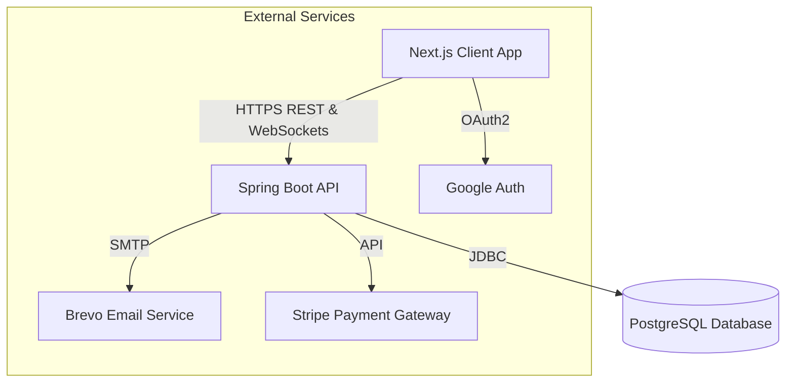
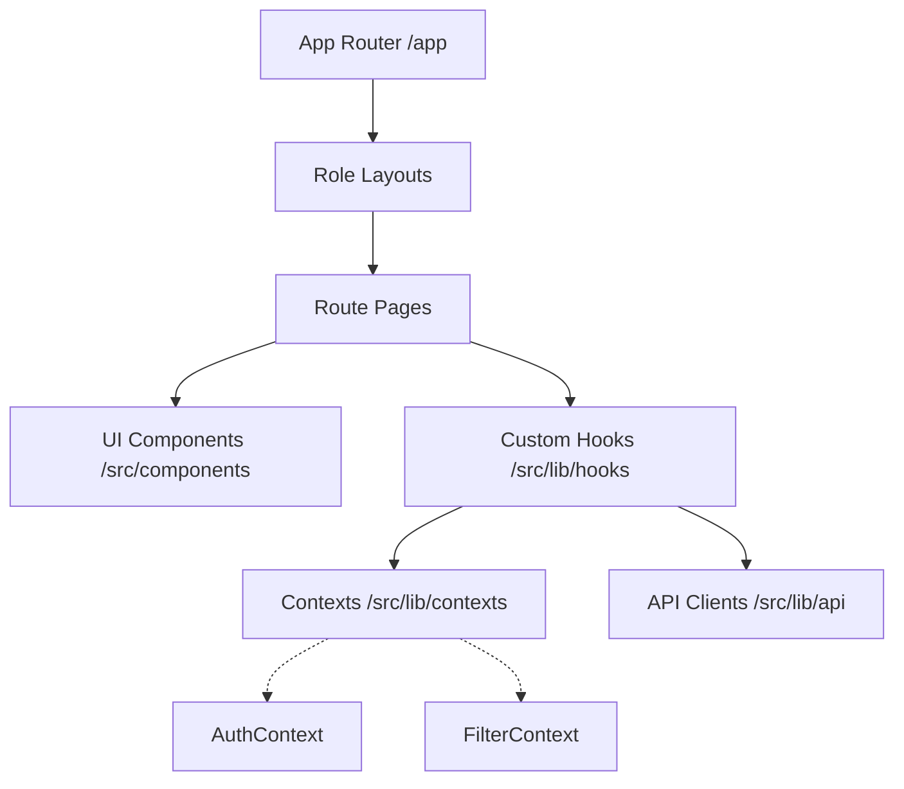
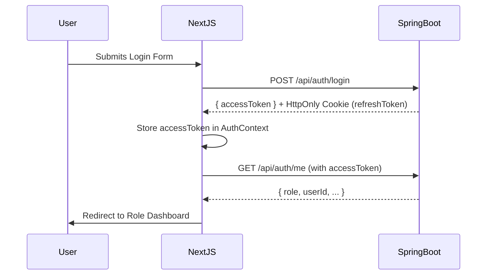

# SafariHub Architecture

This document outlines the high-level architecture of SafariHub.

## System Overview

SafariHub follows a modern, decoupled client-server architecture.



## Backend Architecture (Spring Boot)

The backend follows a standard layered architecture.

```mermaid
graph TD
    Controllers[REST Controllers] --> Services[Business Logic Services]
    Services --> Repositories[JPA Repositories]
    Repositories --> Database[(PostgreSQL)]
    
    subgraph "Cross-Cutting Concerns"
        Security[Spring Security & JWT]
        Time[TimeService (UTC)]
        WebSockets[STOMP Message Broker]
    end
    
    Controllers -.-> Security
    Services -.-> Time
    Services -.-> WebSockets
```

### Key Components:
1.  **Controllers:** Handle incoming HTTP requests, validate basic input using DTOs, and route to appropriate services.
2.  **Services:** Contain the core business logic (Booking lifecycle, payment calculation, notification routing).
3.  **Repositories:** Interface with PostgreSQL using Spring Data JPA.
4.  **Scheduled Jobs:** Background processes for tasks like payment timeouts (`PaymentTimeoutJob`) and review reminders (`ReviewReminderJob`).

## Frontend Architecture (Next.js)

The frontend uses Next.js 16 App Router for robust role-based layouts and server-side rendering where appropriate.



### Key Components:
1.  **Role-Based Routing:** The `/app/dashboard` directory is split into `/traveler`, `/guide`, and `/admin`, each protected by Layout guards checking the AuthContext.
2.  **API Client:** A centralized Axios instance (`src/lib/api/client.ts`) handles request interception (injecting JWTs) and response interception (handling 401s and token refreshes automatically).
3.  **Contexts:** React Context is used sparingly for global state like Authentication (`AuthContext`) and Search Filtering (`FilterContext`).

## Database Schema (High-Level)

```mermaid
erDiagram
    USER ||--o{ TRAVELER_PROFILE : has
    USER ||--o{ GUIDE_PROFILE : has
    
    GUIDE_PROFILE ||--o{ TOUR_TEMPLATE : creates
    TOUR_TEMPLATE ||--o{ TOUR_OCCURRENCE : spawns
    
    TRAVELER_PROFILE ||--o{ BOOKING : makes
    TOUR_OCCURRENCE ||--o{ BOOKING : receives
    
    BOOKING ||--o| PAYMENT : requires
    BOOKING ||--o| REVIEW : gets
    
    USER ||--o{ NOTIFICATION : receives
    USER ||--o{ MESSAGE : sends/receives
```

## Authentication Flow


