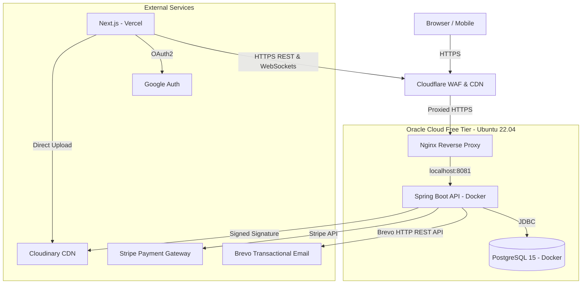
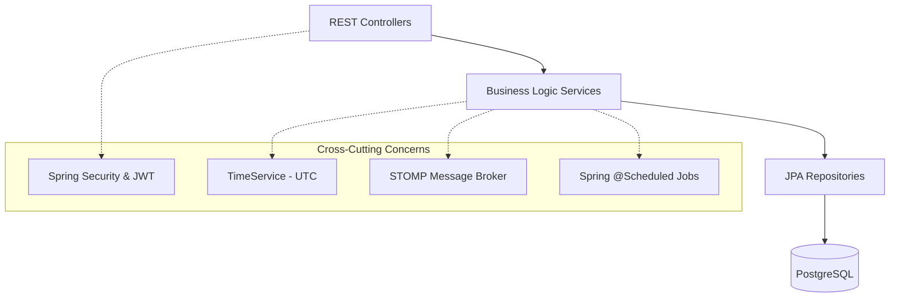
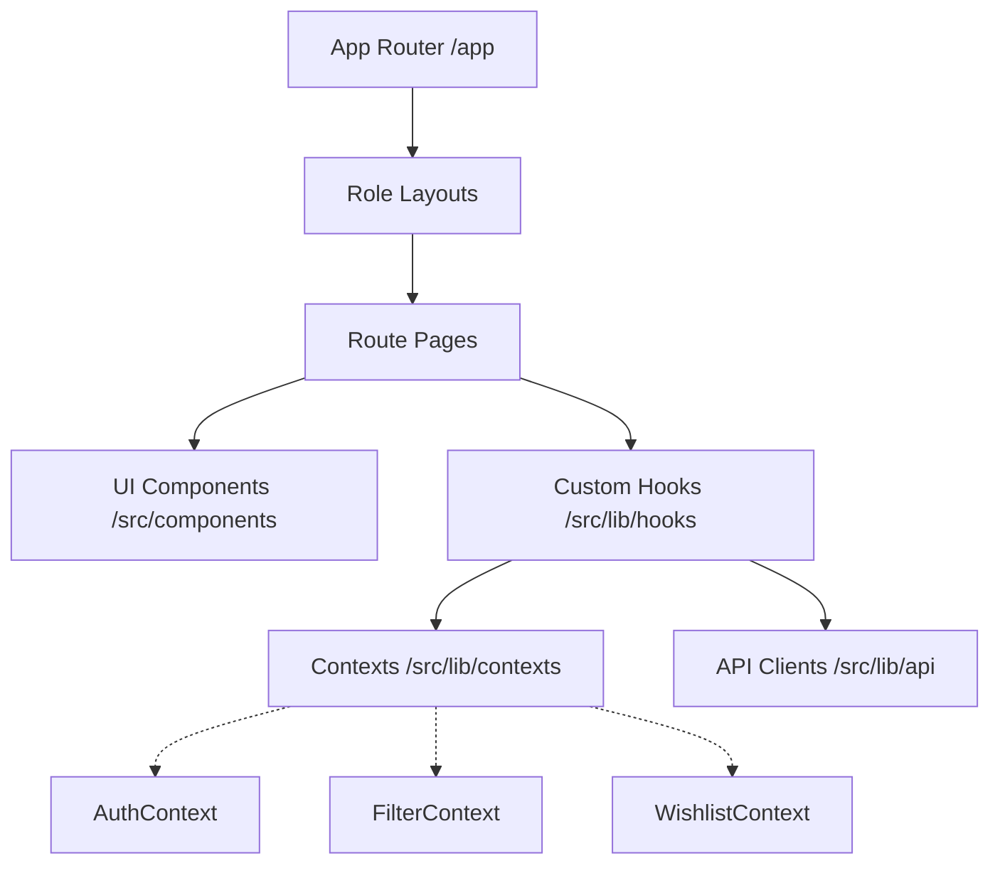
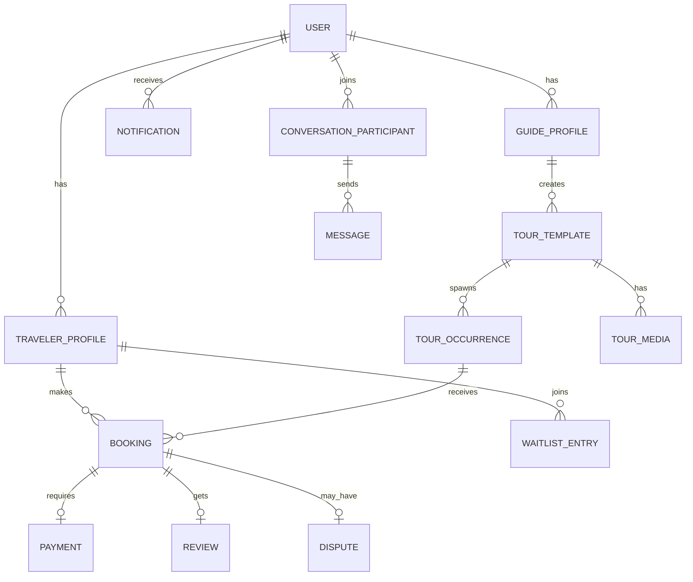
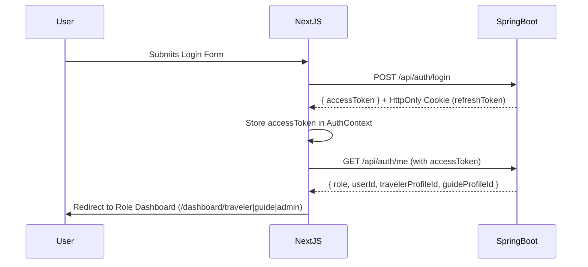
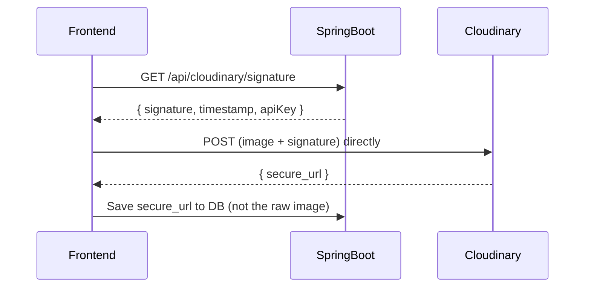

# Tourongo Architecture

This document outlines the high-level architecture of Tourongo.

## System Overview

Tourongo follows a modern, decoupled client-server architecture deployed on custom production infrastructure.

## Backend Architecture (Spring Boot)

The backend follows a standard layered architecture.

### Key Components:
1.  **Controllers:** Handle incoming HTTP requests, validate basic input using DTOs, and route to appropriate services. Never contain business logic.
2.  **Services:** Contain the core business logic (Booking lifecycle, payment calculation, notification routing). All marked `@Transactional` when writing.
3.  **Repositories:** Interface with PostgreSQL using Spring Data JPA. All queries on soft-deletable entities include `AND entity.deletedAtUtc IS NULL`.
4.  **Scheduled Jobs:** 5 background jobs — `PaymentTimeoutJob`, `ReviewReminderJob`, `BookingStatusCleanupJob`, `SuspensionCleanupJob`, `PayoutReleaseJob`.

## Frontend Architecture (Next.js)

The frontend uses Next.js 16 App Router for robust role-based layouts and server-side rendering where appropriate. Deployed globally on Vercel.

### Key Components:
1.  **Role-Based Routing:** The `/app/dashboard` directory is split into `/traveler`, `/guide`, and `/admin`, each protected by Layout guards checking the AuthContext.
2.  **API Client:** A centralized Axios instance (`src/lib/api/client.ts`) handles request interception (injecting JWTs) and response interception (handling 401s and token refreshes automatically — concurrent 401s are queued).
3.  **Contexts:** React Context is used sparingly for global state — Auth (`AuthContext`), Search Filtering (`FilterContext`), Wishlist (`WishlistContext`), and multi-step Signup (`SignupContext`).

## Production Infrastructure

| Layer | Technology | Purpose |
|-------|------------|--------|
| DNS & Edge | Cloudflare | WAF, DDoS protection, instant DNS propagation |
| Frontend | Vercel | Next.js SSR + automatic preview deployments |
| Reverse Proxy | Nginx + Certbot | SSL termination, routes to Docker containers |
| Backend | Spring Boot on Oracle Cloud | Java API on Ubuntu 22.04 with 2GB Swap |
| Database | PostgreSQL 15 (Docker) | Self-hosted, persistent, no cold-start delay |
| Images | Cloudinary | Direct-to-cloud uploads, CDN delivery |
| Email | Brevo HTTP REST API | Bypasses SMTP port blocks on cloud providers |
| CI/CD | GitHub Actions | Auto-deploy on push to main via SSH |
| Backups | Oracle Vault VM (rsync pull) | Ransomware-isolated nightly DB snapshots |

## Database Schema (High-Level)

## Authentication Flow

## Image Upload Flow (Cloudinary)

