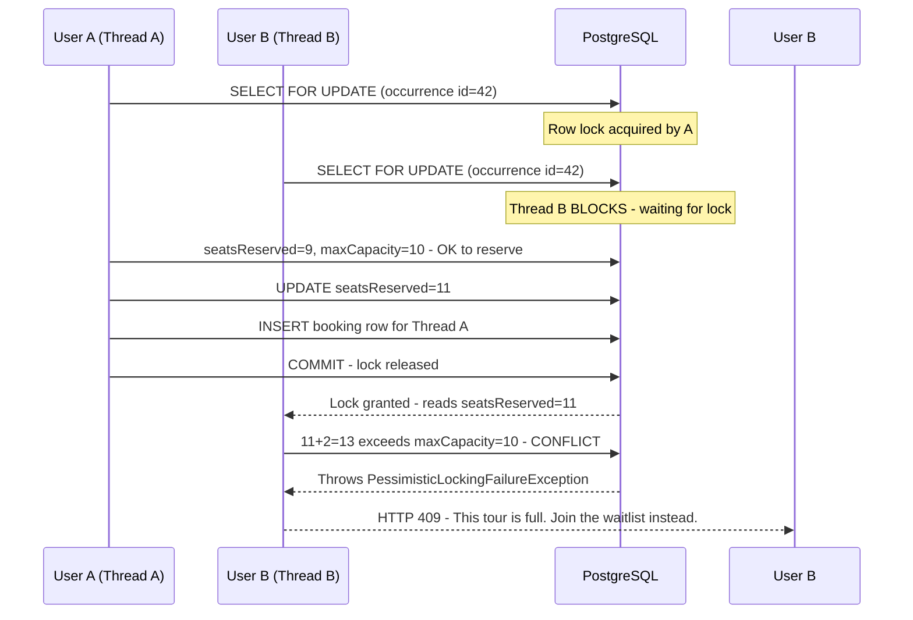

# Concurrency Protection — Booking System

> **Last updated:** April 2026  
> **Applies to:** `BookingService`, `TourOccurrenceRepository`, `Booking` entity

---

## Overview

The booking system protects against **double-booking** and **overbooking** using a
two-layer concurrency strategy:

| Layer | Mechanism | Scope | Purpose |
|---|---|---|---|
| 1 | **Pessimistic Write Lock** (`SELECT … FOR UPDATE`) | `TourOccurrence` row | Prevents two threads from simultaneously reading the same seat count and both deciding there's room |
| 2 | **Optimistic Locking** (`@Version`) | `Booking` row | Secondary defence — prevents two concurrent Booking INSERT/UPDATEs from silently clobbering each other |

Both layers work together. Layer 1 closes the **TOCTOU window** on the availability check.
Layer 2 remains as a safety net for the `PaymentTimeoutJob` scheduler racing with a live payment confirmation.

---

## Why Pessimistic Locking?

### The Race Condition (without locking)

```
Thread A:  read seatsReserved=9, maxCapacity=10  →  9+2=11 > 10? No → reserve 2 seats
Thread B:  read seatsReserved=9, maxCapacity=10  →  9+2=11 > 10? No → reserve 2 seats
                                                                               ↑
                                                              Both pass! One seat sold twice.
```

Both threads read `seatsReserved = 9` before either writes `11`. Both conclude there is
capacity. Both create bookings and push the counter to `11`, exceeding `maxCapacity = 10`.

This is a **Time-of-Check / Time-of-Use (TOCTOU)** race condition.

### Why pessimistic over purely optimistic?

`@Version` on `Booking` only detects conflicts **at the INSERT/UPDATE level** — after the
capacity check has already passed. It catches a *racing insert* on the Booking row, but
does **not** prevent two threads from *simultaneously reading* the occurrence's seat count
before either writes back.

Pessimistic locking (`SELECT … FOR UPDATE`) acquires an exclusive row lock **before** the
capacity is read, so the second thread never even sees the stale value.

---

## Implementation

### Critical Section — `createBooking()`

```
resolveOccurrenceWithLock(id)       ← acquires SELECT … FOR UPDATE on tour_occurrences row
│
├── validateOccurrenceBookable()    ← reads status, checks kill-switch
├── check seatsReserved + requested ≤ maxCapacity
├── reserveSeats()                  ← increments seatsReserved
└── bookingRepository.save()        ← creates Booking row (also protected by @Version)
    │
    └── @Transactional COMMIT ──────────────── lock released here
```

Any concurrent request for the **same occurrence ID** blocks at `SELECT … FOR UPDATE`
until the first transaction commits. It then re-reads the updated `seatsReserved` and,
if the occurrence is now full, receives HTTP 409.

### Critical Section — `updateBooking()`

When a traveler changes their booked occurrence (reschedule):

```
Lock both old and new occurrence rows (by ID order — smallest ID first)
│
├── Release seats on old occurrence
└── Reserve seats on new occurrence
    └── COMMIT → both locks released
```

Locking in **ascending ID order** prevents deadlocks when two users simultaneously
swap between the same pair of occurrences in opposite directions.

---

## Lock Configuration

| Setting | Value | Where |
|---|---|---|
| Lock mode | `PESSIMISTIC_WRITE` (`SELECT … FOR UPDATE`) | `TourOccurrenceRepository.findByIdWithLock()` |
| Lock timeout | **2000 ms** | `@QueryHint("jakarta.persistence.lock.timeout", "2000")` |
| Timeout exception | `PessimisticLockingFailureException` | Thrown by Hibernate if the lock isn't granted within 2 s |
| HTTP response on timeout | **HTTP 409** | `GlobalExceptionHandler.handlePessimisticLock()` |

### Adjusting the Timeout

The 2-second timeout is configured in `TourOccurrenceRepository`:

```java
@QueryHints(@QueryHint(name = "jakarta.persistence.lock.timeout", value = "2000"))
```

- **Lower** (e.g. `500`) = faster failure under contention, higher 409 rate for slow requests
- **Higher** (e.g. `5000`) = longer wait, better UX for slow DB, risk of thread pile-up under extreme load
- **`-1`** = no timeout — **never use in production** (can cause indefinite blocking)

---

## Flow Diagram



---

## Edge Cases

### 1. Simultaneous booking requests (happy path)

**Scenario**: 5 users simultaneously request the last 1 seat.

| Request | Outcome |
|---|---|
| First to acquire lock | Succeeds → HTTP 200 |
| 2nd–5th (queue behind lock) | Each reads updated count after previous commit → HTTP 409 |

### 2. Lock timeout

**Scenario**: The first transaction is abnormally slow (> 2 s) — e.g., a DB hiccup.

- Waiting thread receives `PessimisticLockingFailureException`
- Mapped to HTTP 409: _"This slot is currently being booked by another user. Please wait a moment and try again."_
- The user can retry; the first transaction either completes or rolls back and releases the lock

### 3. Payment failure / expiry

**Scenario**: Traveler books (seats reserved, status = `PendingPayment`) but doesn't pay.

- `PaymentTimeoutJob` runs every 60 s, finds expired `PendingPayment` bookings
- Calls `releaseSeats()` → restores `seatsReserved`
- Promotes next waitlist entry if any
- `@Version` on `Booking` protects against the scheduler and a simultaneous Stripe webhook both writing to the same Booking row

### 4. Booking cancellation (traveler or guide)

**Scenario**: A `Confirmed` booking is cancelled.

- `cancelBooking()` / `rejectBooking()` call `releaseSeats()` → decrements `seatsReserved`
- `promoteFromWaitlist()` offers the freed seat to the next queued traveler
- Runs inside `@Transactional` — no lock required here because the Booking already exists and `@Version` covers concurrent cancellation attempts

### 5. Rescheduling (updateBooking with different occurrence)

**Scenario**: Two users simultaneously try to move bookings between the same two occurrences (A→B and B→A).

- Both threads try to lock occurrence A and occurrence B
- By locking in ascending ID order (lowest ID first), both threads acquire locks in the **same order** → no deadlock
- One thread proceeds first; the other waits, then reads the updated counts

---

## Security Notes

- The lock is enforced **server-side** at the database level. There is no API endpoint or request parameter that can bypass it.
- There is no "skip lock" parameter accepted anywhere in the booking API.
- `@Transactional` boundaries ensure the lock is held for the minimum required duration (availability check → seat reservation → booking save → commit).

---

## Database Index

Migration `V54__add_occurrence_locking_index.sql` adds:

```sql
CREATE INDEX IF NOT EXISTS idx_tour_occurrences_active_id
    ON tour_occurrences (id)
    WHERE deleted_at_utc IS NULL;
```

This partial index ensures the `SELECT … FOR UPDATE WHERE id = ? AND deleted_at_utc IS NULL`
row lookup is O(log n) rather than a table scan, reducing the time spent waiting to
acquire the lock.
